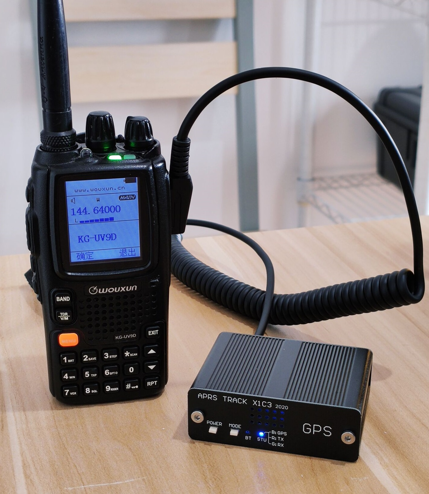
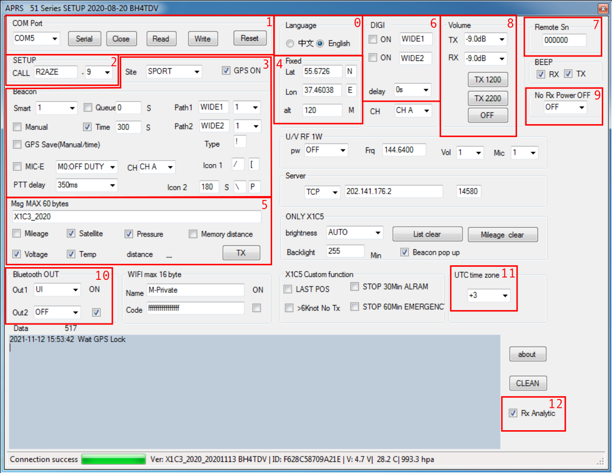

# X1C3 APRS Tracker: The Missing Manual

This mysterious device, available from the manufacturer and in many an Aliexpress shop near you, is a battery-powered APRS tracker meant to attach to a variety of radios, combined with a Bluetooth TNC, with built-in digipeater functionality.

The stock software is pretty horrible, and the stock manual is even worse, but the actual device is kinda neat, and is a decent alternative to the scarcely available [Mobilinkd TNC](http://www.mobilinkd.com/) that everyone else is recommending.

I took it upon myself to write something that makes sense and here it is. This manual comes with a configuration saving/loading tool, `x1c3tool`, which you will find in the same Github repository as the manual itself. This tool, unfortunately, does not make the stock software obsolete.

You can acquire the [stock software](http://venus-itech.com/download/APRS_51Serial_20190723.rar) at the [manufacturer's website](https://www.venus-itech.com/). The software is shared between multiple related models of the device, so I'm giving a link to the newer version, rather than the one that's on its own [product page](https://www.venus-itech.com/product/x1c3-aprs-tracker/).

That's where you get the stock manual, in case you still need it.

This manual only covers the functionality found in X1C3 itself. (And even then, mostly the features I could verify as working and properly document.) Other related devices that include it as a subset but also do other things are:

* X1C5 self-contained tracker/Bluetooth TNC/iGate with built-in radio.
* Lanchonlh HG-UV98 handheld radio with APRS.
* 51TNC2, an Ethernet-connected TNC/iGate device.
* 51-WG5 / 51-WG6 / 51-WG7 APRS add-on for Yaesu radios.

Since I don't own any of them I can't say how much is actually different, but all of them use the same (or very similar) configuration software and quote the same barely comprehensible English lines in their manuals. All are derived from the work credited to BH4TDV, whether the said amateur is involved in their manufacture directly or not.

## Hardware

There are only two buttons -- marked `POWER` and `BT`. `BT` button enables and disables Bluetooth. There are few indications that the device is working beyond the Bluetooth light, which is constantly flashing when Bluetooth is not connected and holding when it is, and the GPS light, which is blue when GPS has a fix. If you turned Bluetooth off, you might not notice it's actually powered on at all, and it will eventually run the battery down, so beware.

On power on, the device flashes the red TX light several times, indicating the level of battery charge:

* 6 -- 100%, never happened to me in practice.
* 5 -- 80%
* 4 -- 60%
* 3 -- 40%
* 2 -- 20%
* 1 -- ~0%

The label `GPS` is positioned immediately above the GPS module's antenna, so presumably you want that side looking up into the sky if possible.

The device uses a 103450 LiPo battery, which is easy enough to replace if needed. The battery is charged through the micro-USB plug, and the `CHG` light goes out once it is fully charged.

The radio is connected with a supplied cable for K1 (Kenwood) microphone socket. Since the device properly handles PTT, there's no need for VOX. The pinout of the RJ11 socket it plugs into on the device's side is like so, with the plug's hook away from you and pins numbered left to right:

1 - NC, 2 - Microphone, 3 - GND, 4 - PTT, 5 - Speaker, 6 - NC

The stock manual numbers the pins in reverse for some reason -- if you decide to make your own cable, double-check against the stock one. In case you're unsure, the pins are labeled on the motherboard itself.

The K1 socket on the device itself is meant for an external passthrough microphone. APRS traffic is *not* muted on this mike, so its usefulness on the general APRS frequency is rather limited. Unfortunately, your typical K1 plug interferes with the placement of the micro-USB socket and will prevent connecting a microphone and a USB cable simultaneously unless you find a microphone with a rare straight K1 plug somewhere.

## Software

Here's a marked up screenshot of the stock software that I will be explaining:

### Connecting to the device

You will need to ensure your system can use a CH340 USB-Serial converter. I'm not clear about OSX, but most Linux distributions handle them out of the box. Windows systems require installing a driver, unless you did that already. You can find a [CH340 driver on the manufacturer's website](http://www.wch.cn/download/CH341SER_EXE.html) or in any number of places across the net, since it's used in a lot of devices.

Identify the section marked **0** on the picture of the setup tool UI and switch the user interface to English before you proceed. Unfortunately you will need to do that every time you start the setup tool.

Section **1** controls the connection to the device. `Serial` will refresh the list of the serial ports, allowing you to select the correct one from the dropdown. `Open/Close` will open and close the port, `Read` and `Write` will read the configuration from the device and write it back, respectively. `Reset` will issue an AT command that resets the configuration to factory defaults, which takes effect immediately and overwrites the config in the EEPROM.

Notice that while the serial port will *connect* if you just plug the device in, reading configuration from it while it's not powered on by the power button will fail -- this tripped me up multiple times.

Contrary to what the official manual says, configuration is *never* saved automatically beyond that `Reset` button, and is always saved as a whole.

### Beaconing

Section **2** sets the callsign and the APRS SSID the device identifies itself as on the air, but this only affects the beacons it generates. When used as a TNC, no changes to the packets coming in will be applied. Native beaconing and sending packets over the TNC interface smoothly coexist, which makes it practical to keep the device beaconing on its own while occasionally connecting to the Bluetooth TNC with APRSDroid to send and receive messages.

Section **3** primarily deals with beaconing rules:

* `GPS ON` checkbox enables and disables the builtin GPS receiver. You can disable this checkbox, switch to `SPORT` mode, and the device will not beacon by itself, because GPS is off.
* `Site` is the deceptively named dropdown that selects whether the device is meant to be moving or stationary:
  * `FIXED` selects the stationary mode. Coordinates sent over the air will be taken from the fields in Section **4**. The fields are sent out verbatim, so you are expected to write them as they are described on page 23 of the [APRS protocol specification][APRS], with the N/E/S/W written into separate fields.

    By setting `Site` to `FIXED`, disabling all the checkboxes in Section **3** and setting `Smart` dropdown to `OFF` you get a pure Bluetooth TNC that does not transmit anything that didn't come in via KISS.
  * `SPORT` selects the moving mode. In `SPORT` mode, the GPS data is used for beaconing. The circumstances which cause beacons to be sent out depend on the state of the other checkboxes and fields in Section **3**.

    No beacons will be sent out *at all* until the device has a GPS fix. The stock manual repeats this multiple times just to make sure this doesn't trip you up.
  * `WS` mode is not documented, and appears to behave identically to the `FIXED` mode. I have no clue what it's supposed to do and careful investigation of the manuals for related devices didn't clue me in either.
* `Smart` dropdown is either `OFF` or enables [smart beaconing](http://www.hamhud.net/hh2/smartbeacon.html) based on motion patterns using one of the predefined sets of constants. According to the manual *for X1C5*, which is indeed a closely related device, these mean the following:

  * `1` - Car mode. Base interval is 20 seconds.
  * `2` - Bicycle mode. Base interval is 40 seconds.
  * `3` - Walking mode. Base interval 60 seconds.
  * `4` - Slow walking mode, like mountain climbing. Base interval is 90 seconds
  * `5` - Nearly stationary mode. Base interval is 120 seconds.

  Yes, I had to go fish for the manuals to the other related devices to find that important tidbit.
* `Manual` checkbox makes the device send out a beacon once the PTT is *released* on the microphone that is plugged into the device itself, i.e. immediately once you finish talking. Being an external device, X1C3 can't change the frequency to do it, so this is generally only suitable for using in situations where you have a repeater that handles reception of APRS packets on its own frequency, i.e. [what MIC-E data format was originally intended for][MIC-E]. However, you might want to rig up a button just for the convenience of being able to beacon on command without doing something more complicated.
* `Time` sets the maximum time between packets. `Smart` plus a `Time` of, say, 300 seconds is reasonable. `Time` on its own will beacon once every given number of seconds.
* `Queue` is pretty bizarre, because this beaconing frequency algorithm works in parallel with every other one. If you select this, the device will beacon once every minute, at the specified number of seconds plus one, based on the GPS clock. I'm really at a loss why did anyone want this, since on the public APRS frequency you are strongly advised against doing anything of the sort.

APRS packet settings for beaconing are also in Section **3**:

* `Path1` and `Path2` describe the digipeater path applied to the packets the device generates. Which APRS digipeater path to use is [a more involved discussion than this manual can accommodate](http://www.wa8lmf.net/DigiPaths/index.htm), but the reasonable default is `WIDE1`, `1`, `WIDE2`, `1`, which will translate to `WIDE1-1,WIDE2-1` and means "ask the local area digipeaters to repeat it once, and ask the wide area digipeaters to repeat it once too." Depending on digipeater activity in your area, you might want something else. Setting a faux-SSID dropdown to 0 disables the corresponding path component. Unfortunately, this means you can't have a path component without a SSID at all, though you can, for example, have just `WIDE2-1` as your digipeater path.
* `Type` is the APRS data type identifier, described in the [protocol specification][APRS] on page 17. The factory default is `!`, i.e. that the beacon is a position without timestamp, which additionally indicates the device has no messaging capability. I don't know if anything seriously pays attention to the APRS data type in this day and age, but if you use the device as a tracker-plus-TNC, you might want to put `=` in that field. This will be ignored if you use `MIC-E`, as in that case, the data type identifier field is repurposed.
* `MIC-E` checkbox enables [MIC-E compression][MIC-E], which packages the positioning data into otherwise less-relevant fields in the packet data structure and shortens the packet considerably. The nearby dropdown allows you to select a MIC-E status. If you don't enable this, [APRSDroid](https://aprsdroid.org/) in particular will display course, speed and altitude as part of the message itself, *(with no space between the start of the text message and the end of the speed/course/altitude data, too)* but I think it's actually APRSDroid parsing them wrong here. On the other hand, MIC-E compression is reported to be responsible for [data corruption in certain parts of the APRS network using archaic software](https://owenduffy.net/blog/?p=2326), so depending on where you are, you might want this off.
* `Icon 1` and `Icon 2` allow you to select which APRS icon your beacon will be represented with. You can find the description of what they mean on page 90 of the [APRS protocol spec][APRS]. A more human-readable description can be found in [this APRS symbols list](https://www.aprsdirect.com/symbol/list) -- just remember that in the X1C3 software, the Code column of that table is on the right, and the Table ID column is on the left -- so `/`, `[` means an icon of a human.

  `Icon 1` pair of fields is the default beacon icon. The `Icon 2` pair, with an accompanying field of a number of seconds, will be sent if the device detects you were stationary for that number of seconds or longer -- defaulting to 180. By default, the second icon is a "parking" sign. If you don't want this feature, just set identical icons. Be aware that when using GPS power saving (described below) it's likely that positioning precision will suffer, and your device will be considered always moving, so you'll never see the second icon.

Other important settings in Section **3**:

* `GPS Save(Manual/time)` enables GPS power saving mode. The GPS is kept off until it's time to beacon, upon which it is turned on, the position is reacquired, and the beacon is sent out. Smart beaconing requires a constant GPS fix to function, so if you turn on smart beaconing as well, this checkbox will be ignored.
* `PTT delay` specifies a delay in microseconds between the start of transmission and the start of sound. As far as I can tell, this applies to all packets sent out by the device, including the ones coming in via KISS interface. Set something sensible depending on your radio.

Other *unimportant* settings in Section **3**:

* `CH`: Do not get confused by this dropdown. X1C3 shares much of its hardware and software with the APRS parts of **Lanchonlh HG-UV98** handheld radio, in which this dropdown controls which of the two VFOs beacon packets will go out on. Being an external device connecting over a microphone plug, X1C3 cannot select between VFOs, so this setting has no effect.

Section **5** contains the fields describing extra information that goes into the message part of the beacon, as well as some tangentially related functions.

* The unmarked text field starts the message and can contain more or less anything up to a limit of 60 bytes. Everything else gets tacked on at the end, separated by spaces.
* `Mileage` checkbox will add the distance traveled. `Mileage memory` checkbox will enable saving the mileage counter between reboots if checked. `Mileage clear` button will clear this counter explicitly. As far as I can tell, mileage counter is part of the configuration EEPROM, so saving and loading configuration will mess it up anyway.
* `Voltage` will add the battery voltage.
* `Satellite` will add the number of currently visible satellites.
* `Temp` is supposed to add the current temperature according to the sensor inside the device, which is higher than ambient. Ironically, ticking this checkbox off does nothing and the temperature gets added anyway in the 20201113 version of the firmware.
* `Pressure` adds the pressure according to the sensor inside the device. Not only it's in hectopascales, this checkbox is broken like the temperature one.
* `TX` button will force the device to beacon immediately. This can be used for testing and tuning your radio.

Everything you tack onto the beacon increases transmission time, so it's wise to turn off everything you don't actually need. Unfortunately, bugs prevent you from turning off temperature and pressure.

### Digipeating

Whether the device will digipeat is described by the checkboxes in Section **6**. Both checkboxes correspond to two digipeater aliases the device listens to -- by default, `WIDE1` and `WIDE2`, which makes for a rudimentary, but effective enough digipeating capability.

The `delay` field introduces a delay before digipeating a heard packet.

The six-digit code in Section **7** is related to enabling and disabling digipeating remotely. According to the official manual, the device listens for "a beacon" containing a message in the form of "\<code\>\<command\>" where "command" is one of `A0`,`B0`,`A1`,`B1` and `R0`.

* `A` commands control the alias marked `DIGI 1` while `B` commands control `DIGI 2`
* `1` turns the alias on, while `0` turns it off.
* `R0` command resets the state to the one stored in the EEPROM

Further experimentation is required to ascertain whether this remote control does, in fact, work. I have not managed to invoke it by sending messages into the device from the BT side, so it might only work over the air, if at all.

Which is a shame, because the ability to enable and disable digipeating in the field would be handy.

### Bluetooth settings

While I say "Bluetooth," it appears that internally, the device has only one input-output stream, which is shared between Bluetooth SPP and the USB serial port. It is shared so much, that if you connect to it over Bluetooth, you can use my `x1c3tool` program to save and load configuration this way, so an Android application to manipulate the settings in the field is not out of the realm of possibility -- it just would take more spare time to write than I currently have.

The device's Bluetooth module is always discoverable unless connected. The name is *supposed* to be set to `<callsign>-<ssid>` on power on, but sometimes isn't, because of the way the serial interface gets confused about linebreaks. The default pin code for pairing is `1234`.

The settings that control Bluetooth behavior are in Section **10**:

* The unnamed checkbox enables and disables the Bluetooth module, so you can just plug your device into USB and have an USB-Serial TNC without Bluetooth at all, if you like.
* `Out1` dropdown selects the primary stream behavior:
  * `OFF` just disables everything, which is probably not something you want even if you disable Bluetooth entirely.
  * `KISS Hex` presents a proper KISS TNC interface.
  * `UI` presents a more human-readable interface, where received and transmitted packet contents are printed one per line, and occasional informative messages appear. This is the setting you want while you're tuning your radio and otherwise fiddling with the device. What's very strange is that APRSDroid actually keeps working fine when the device is in this mode, and I'm not entirely clear why -- presumably, the device recognizes KISS traffic when it receives it, but why does APRSDroid accept the one-packet-per-line messages, when it's configured for a KISS TNC?
  * `GPWPL` replaces output of transmitted beacons with NMEA "Waypoint Location" sentences. Received beacons seem not to appear at all. Presumably, you can use this in conjunction with some kind of navigator device for rendering the map, but the specific use case eludes me, since incoming APRS packets aren't getting parsed into GPWPL sentences as far as I can tell.
  * `KISS Asc` prints -- and presumably, expects -- incoming packets as if they were KISS frames, but translates them into a hexadecimal ASCII representation. That is, instead of sending 0xC0, it sends `C0`, etc. The use case eludes me and nothing else seems to work with this format.
* `Out2` is the secondary stream behavior -- rather than present a separate stream as the manual wants to imply, (where would it even do that?) it appears to intermix extra data into the same one.
  * `GPS` dumps raw GPS NMEA output the way it is received from the GPS into the stream. The intention, presumably, is to have an option to take over the beaconing functions of the device from the PC side without having an extra GPS in the system, though it would require some creative fiddling with the serial port to do.
  * `Rotator` is the most obscure function of the device. According to the original manual, the device is capable of controlling a Yaesu antenna rotator through the GS-232B interface to point at the beacons as they are heard. It certainly *tries* to -- in the `UI` mode, you can occasionally see output pertaining to that function, describing calculations of the relative positions resulting in an antenna azimuth. However, it's entirely unclear to me how would the data get to the rotator itself, or why this is done for directly received packets but not digipeated packets. Current versions of the setup tool are missing a bunch of buttons related to this function, so this might be specific only to certain versions of the device.

### Radio adjustment

Section **8** contains dropdowns which control volume levels for RX and TX audio, as well as two buttons for transmitting test signals.

In my experience, the device had a really hard time decoding packets until I set the RX level at -9.0dB. You want to fiddle with your particular radio and these volume levels for best results.

`TX 1200` and `TX 2200` buttons will transmit a 1200Hz and a 2200Hz tone, respectively, to aid you in tuning. `TX OFF` button will stop the transmission.

### Other stuff

* The `No Rx Power OFF` dropdown in Section **9** will turn the device off after the specified time elapses since the last received and parsed packet.
* `UTC time zone` dropdown in Section **11** gets saved to EEPROM, but I have no idea whatsoever whether it's actually used anywhere.
* The function of `Rx Analytic` in Section **12** is a complete mystery, but it, too, is saved to the EEPROM.

### AT commands

While the original manual implies some AT commands over the serial interface would allow you to change configuration this way, hardly any of them work. Here are all the commands that I've been able to verify as working:

* `AT+VER=?` reports device version.
* `AT+DEMO=ON` results in factory reset.
* `AT+LC=CLEAN` clears mileage counter.
* `AT+SET=READ` dumps the EEPROM back into the stream, pre-pending a 5-byte header that reads `HELLO` for *some* reason.
* `AT+SET=WRITE<eeprom>` writes the EEPROM back. The EEPROM being saved and loaded is exactly 512 bytes.
* `AT+TX=ON` is equivalent to clicking the `TX` button and forces a beacon to be sent.
* `AT+TONE=1200`, `AT+TONE=2200` and `AT+TONE=OFF` are the way the `TX 1200`, `TX 2200` and `TX OFF` buttons control the device.

Commands, with the exception of `AT+SET=WRITE`, are expected to terminate with CRLF.

One particular command I've found only works when connected to the Bluetooth SPP interface: `AT+NAME<name>` sets the Bluetooth name of the device. This is handled by the Bluetooth module itself. Occasionally, the CPU tries to rewrite the Bluetooth name, with mangled results, since it forgets to CRLF-terminate the string. The Bluetooth module used in my particular device is [HC-02](http://www.hc01.com/products/8), and according to the manufacturer's datasheet, it should also support `AT+PIN<4-digit pin code>`, and a few other AT commands that appear less useful. I have not verified whether the device resets the PIN code in the Bluetooth module, however, like it does with the Bluetooth name.

Sometimes, you can see the device send `AT+KISS=OFF` and `AT+KISS=ON` into the serial port when restarting. When trying to send those, both actually respond with `OK`, but it's not clear whether anything actually happens as a result.

**P.S.** Oh, and if you're up to buying a cheap HT for use with this, I recommend a Quansheng UV-R50-2, rather than the ubiquitous Baofeng UV-5R: it's only a little more expensive, but has actual filters.

[APRS]: http://www.aprs.org/doc/APRS101.PDF
[MIC-E]: https://www.marcelpost.com/wiki/index.php/MIC-E

